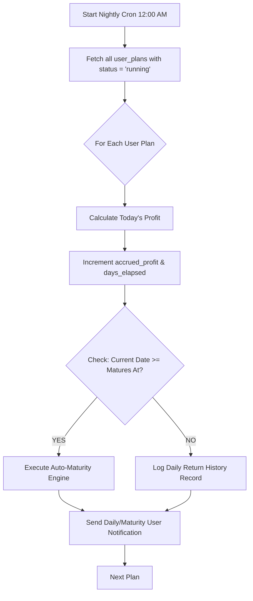

# Design Specification: GullakPe Admin Panel – Create Plan System & Business Engines (v1.0)

**Date**: 2026-07-28  
**Status**: Draft / Pending Approval  
**Source Document**: GullakPe Admin Panel – Create Plan System (Developer Documentation v1.0)  

---

## 1. Overview & Core Philosophy

GullakPe is a digital savings/investment platform with a strict, non-traditional profit return model:
1. **Investment Principal is NEVER Returned**: The principal amount invested in any plan (Fixed, Flexible, or Trust Builder) is strictly non-refundable and non-returnable.
2. **ONLY Profit is Credited to Wallet**: Upon plan maturity, **only the accumulated profit** is automatically credited to the user's main wallet balance.
3. **Withdrawal Scoping**: Users can **only** request withdrawals from their available **Wallet Balance**. Running portfolio profit cannot be withdrawn until maturity completes and profit is credited to the wallet.
4. **Automated Daily Profit & Maturity Execution**: All calculations, daily progress updates, maturity transitions, and wallet credits are executed automatically via a scheduled nightly engine at 12:00 AM.

---

## 2. Technical Architecture & Database Schema Changes

### 2.1 `plans` Table Updates

Enhance `plans` schema to support the complete v1.0 Admin Builder options:

```sql
ALTER TABLE plans ADD COLUMN plan_type VARCHAR(20) DEFAULT 'fixed'; -- 'fixed' or 'flexible'
ALTER TABLE plans ADD COLUMN explore_icon_image VARCHAR(255) NULL; -- Explore card icon
ALTER TABLE plans ADD COLUMN interest_rate DECIMAL(5,2) DEFAULT 0.00; -- Interest %
ALTER TABLE plans ADD COLUMN duration_type VARCHAR(20) DEFAULT 'multiple'; -- 'trust_builder' or 'multiple'
ALTER TABLE plans ADD COLUMN status VARCHAR(20) DEFAULT 'active'; -- 'draft', 'active', 'hidden', 'expired', 'out_of_stock'
ALTER TABLE plans ADD COLUMN purchase_limit_type VARCHAR(20) DEFAULT 'unlimited'; -- 'unlimited' or 'limited'
ALTER TABLE plans ADD COLUMN max_purchases INT NULL; -- Total catalog limit
ALTER TABLE plans ADD COLUMN total_purchases_count INT DEFAULT 0; -- Counter for limit
```

### 2.2 `plan_durations` Table Schema

Supports both standard presets (1M, 3M, 6M, 1Y, 2Y) and custom duration units:

| Column | Type | Description |
| :--- | :--- | :--- |
| `id` | BigInt (PK) | Auto increment |
| `plan_id` | Foreign Key | References `plans.id` |
| `duration_value` | Int | Value (e.g. 1, 3, 30) |
| `duration_unit` | Enum (`days`, `months`, `years`) | Unit of duration |
| `duration_days` | Int | Converted total days for calculation |
| `duration_label` | String | Display text e.g. "3 Months" |
| `daily_profit` | Decimal(12,2) | Daily profit for this duration |
| `total_profit` | Decimal(12,2) | Total profit for this duration |
| `total_return` | Decimal(12,2) | Principal + Total Profit (for display) |
| `is_default` | Boolean | Preselected default |
| `sort_order` | Int | Order in UI |

### 2.3 `user_plans` (Portfolio Engine) Table Updates

Represents individual user portfolio holdings:

| Column | Type | Description |
| :--- | :--- | :--- |
| `id` | BigInt (PK) | Auto increment |
| `user_id` | Foreign Key | References `users.id` |
| `plan_id` | Foreign Key | References `plans.id` |
| `plan_duration_id` | Foreign Key | References `plan_durations.id` (nullable) |
| `invested_amount` | Decimal(12,2) | Amount invested (NEVER returned) |
| `daily_profit_val` | Decimal(12,2) | Daily profit calculated |
| `total_profit_val` | Decimal(12,2) | Total promised profit at maturity |
| `accumulated_profit` | Decimal(12,2) | Accrued profit to date |
| `duration_days` | Int | Lock duration in days |
| `days_elapsed` | Int | Days active (0 to duration_days) |
| `status` | Enum | `running`, `completed`, `matured`, `cancelled`, `expired` |
| `purchased_at` | DateTime | Purchase timestamp |
| `matures_at` | DateTime | Maturity timestamp |
| `profit_credited_at` | DateTime | When profit was credited to wallet |
| `withdrawal_status` | Enum | `locked` (while running), `enabled` (after maturity) |

---

## 3. Admin Panel – Create Plan System (Sections 1–13)

### 3.1 Step 1: Select Plan Type Switcher
- Radio/Segmented button at top of Admin Form:
  - **Option 1: Fixed Investment Plan** (Single fixed investment amount, e.g. ₹199)
  - **Option 2: Flexible Investment Plan** (Slider range: Min ₹100, Max ₹1000, Step ₹100)
- Dynamically reveals/hides corresponding Investment Section via JavaScript & Blade templates.

### 3.2 Form Breakdown

#### Section 1 – Basic Information
- **Plan Name** (`title`, required)
- **Short Title / Subtitle** (`subtitle`)
- **Category** (Select or text)
- **Plan Icon Upload** (`icon_image`) -> Shown on Plan Card + Plan Details
- **Plan Thumbnail Upload** (`image`) -> Header/Main image for Plan Details
- **Explore Icon Upload** (`explore_icon_image`) -> Icon for Explore list

#### Section 2 – Investment Configuration
- **Fixed Plan Mode**: Single field `Investment Amount ₹` (e.g. ₹199). No slider, no min/max.
- **Flexible Plan Mode**: `Min Investment ₹`, `Max Investment ₹`, `Slider Step ₹`.

#### Section 3 – Interest Rate & Presets
- Preset Buttons: `1%`, `2%`, `3%`, `5%`, `8%`, `10%`, `12%`, `15%`, `20%`, `Custom %`.
- Selecting `Custom %` reveals an input field `Interest %`.

#### Section 4 – Duration Configuration (Common)
- **Duration Mode**:
  - `Trust Builder (1 Day Only)`: Automatically sets Duration = 1 Day, Auto Wallet Credit = ON, Withdrawal Enabled after 1 Day. No other durations.
  - `Multiple Duration Options`: Admin selects/adds duration rows (Presets: 1 Month, 3 Months, 6 Months, 1 Year, 2 Years, Custom Value + Unit: Days/Months/Years).

#### Section 5 – Automatic Profit Calculator
- Real-time calculations:
  $$\text{Daily Profit} = \frac{\text{Investment Amount} \times \text{Interest Rate \%}}{100 \times \text{Duration Days}}$$
  $$\text{Total Profit} = \text{Daily Profit} \times \text{Duration Days}$$
  $$\text{Total Return (Display Only)} = \text{Investment Amount} + \text{Total Profit}$$

#### Section 6 – Withdrawal Rules
- **Trust Builder Rule**: Runs 1 Day -> Auto Credit **ONLY Profit** to Wallet -> Withdrawal Enabled. Principal is NOT returned.
- **Normal Plan Rule**: Daily profit accrues in Portfolio (Withdrawal LOCKED) -> Matures on End Date -> Auto Credit **ONLY Total Profit** to Wallet -> Withdrawal ENABLED. Principal is NOT returned.

#### Section 7 – Global Withdrawal Limits
- Settings page & validations:
  - Daily Withdrawal Limit: ₹5,000
  - Maximum Requests Per Day: 3
  - Minimum Withdrawal Amount: ₹300
  - Processing Type: Instant vs Manual Approval

#### Section 8 – Unlock System
- Toggle `Enable Unlock Rule` (YES / NO).
- If YES: `Required Plan` dropdown + `Unlock Message` (e.g., *"Complete Premium Plan ₹399 First Then this plan will unlock"*).

#### Section 9 – Wallet Balance Guard
- Purchase validation checks `User Wallet Balance >= Investment Amount`.
- Insufficient balance prompts the **Add Money** modal.

#### Section 10 & 11 – Availability & Purchase Limits
- Statuses: `Draft`, `Active`, `Hidden`, `Expired`, `Out Of Stock`.
- Max Purchases limit (e.g. 100). Automatically transitions plan to `Out Of Stock` when `total_purchases_count >= max_purchases`.

#### Section 12 & 13 – Marketing Badges & Live Preview
- Badges: `Most Popular`, `Trending`, `Hot`, `Recommended`, `Limited Time`.
- Live Preview: Real-time mirror card updating as Admin edits inputs.

---

## 4. Engine Core Specifications (Sections 14–25)

### 4.1 Daily Profit Engine (Nightly 12:00 AM Cron)

Target Command: `php artisan plans:process-daily-returns`



### 4.2 Auto-Maturity & Wallet Credit Engine

When a plan reaches `matures_at`:
1. Change `user_plans.status` from `'running'` to `'completed'`.
2. Set `withdrawal_status = 'enabled'`.
3. Credit **ONLY `total_profit_val`** to the user's `wallet_balances.balance`.
4. **DO NOT** credit or return `invested_amount`.
5. Create a `WalletTransaction` entry:
   - `type`: `profit_credit`
   - `amount`: `total_profit_val`
   - `description`: `"Profit credit for plan: {Plan Title}"`
   - `reference_id`: `user_plan_id`
6. Trigger Notification: *"Your plan {Title} has matured! ₹{Profit} profit credited to your wallet."*

### 4.3 Withdrawal Engine

Validation checklist before allowing withdrawal request:
1. `User Wallet Balance >= Requested Amount`
2. `Requested Amount >= Minimum Withdrawal (₹300)`
3. `Requested Amount <= Daily Limit (₹5,000)`
4. `User Requests Today < Max Daily Requests (3)`
5. Deduct requested amount from `wallet_balances.balance` and record `WithdrawRequest` with status `pending`.

---

## 5. Master Business Rules Summary (Section 42)

| Rule # | Requirement | Implementation Enforcement |
| :--- | :--- | :--- |
| **R1** | Investment Amount is NEVER returned. | Wallet credit on maturity includes ONLY profit. `invested_amount` is retained by system. |
| **R2** | ONLY Profit is credited to wallet. | `WalletBalance::credit($user, $userPlan->total_profit_val)` |
| **R3** | Trust Builder Plan is always 1 Day duration. | Duration locked to 1 Day when `duration_type = 'trust_builder'`. |
| **R4** | Unlock System enforces prerequisite plan. | `PlanPurchaseController` checks if `requires_plan_id` exists in user's completed holdings. |
| **R5** | Withdrawal is LOCKED during running state. | User can only withdraw from main wallet balance, never from running portfolio profit. |
| **R6** | Out of Stock when limit reached. | Automated check in `PlanPurchaseController` and status transition on stock depletion. |

---

## 6. Implementation Plan & Deliverables

1. **Database Migration**: Add new columns to `plans`, `plan_durations`, `user_plans`, and `wallet_transactions`.
2. **Admin Plan Form Overhaul**: Implement dynamic JS switcher for Fixed vs Flexible, preset interest buttons, custom duration units, unlock rules, and live preview.
3. **Daily Profit & Maturity Scheduled Command**: `php artisan plans:process-daily-returns` registered in `routes/console.php`.
4. **Purchase & Portfolio Controllers Update**: Enforce prerequisite unlock rules, wallet checks, stock limits, and profit-only credit logic.
5. **Verification Suite**: Automated Pest/PHPUnit tests covering purchase flow, unlock rules, daily profit calculation, and maturity profit-only wallet crediting.
